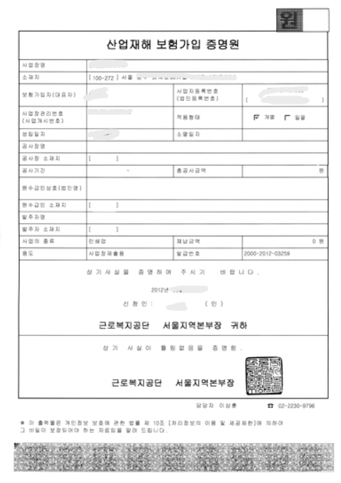
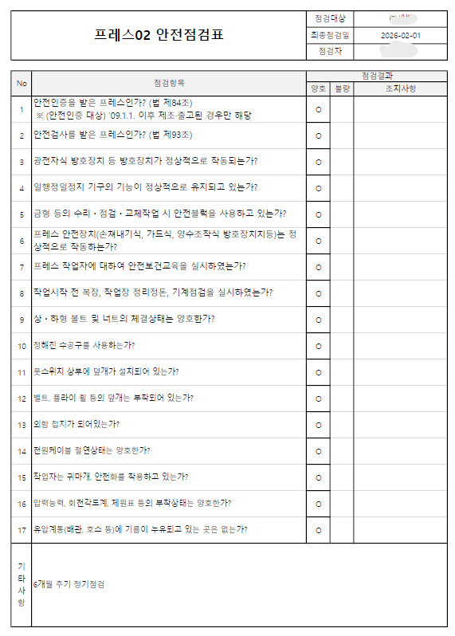

# 🛡️ AI 안전 가디언 계리사 (AI Safety Guardian Actuary)
**현장 위험도(Vision) + 행정 서류(OCR) 통합 분석 기반 지능형 보험료 산정 솔루션**

## 📌 프로젝트 개요
본 프로젝트는 산업 현장의 실시간 안전 상태와 법적 증빙 서류를 AI로 통합 분석하여 객관적인 보험 요율을 산출하는 서비스입니다. 현장 사진(Vision), 산재보험 증명원(OCR), 기계 점검표(OCR/Logic)를 결합하여 실시간 보험료 할인율을 계산하며, '산재예방요율제' 등 실제 산업 안전 제도를 모티브로 설계되었습니다.

## 🖼️ 데이터 분석 예시 (Input Data)
시스템은 다음과 같은 세 가지 멀티모달 데이터를 입력받아 통합 분석을 수행합니다.

| 1. 현장 상황 (Vision) | 2. 산재보험 증명원 (OCR) | 3. 기계 안전점검표 (OCR) |
| :---: | :---: | :---: |
|  |  |  |
| 위험 요소 및 환경 분석 | 보험 가입 정보 및 신뢰도 검증 | 점검 주기 및 불량 항목 체크 |

## 📊 정량적 성과 지표 (KPI Summary)

| KPI 항목 | 분석 결과 (Raw Data) | 영향도 (Weight) |
| :--- | :--- | :--- |
| **현장 위험도 (S_Risk)** | **70점** (금속 가공 및 대규모 공장 환경) | $1 - (70 / 100) = 0.3$ |
| **보험 신뢰도 (I_Trust)** | **85점** (보험 가입 및 관리 정보 정상) | $85 / 100 = 0.85$ |
| **기계 안전 점수 (M_Safety)** | **30점** (점검 기한 내이나 불량 항목 4개 발견) | $30 / 100 = 0.3$ |

### 🧮 보험료 할인율 산출 알고리즘
최종 할인율은 기본 인센티브 **7.0%**를 기준으로 각 지표의 가중치를 연쇄적으로 곱하여 투명하게 산출됩니다.

> **계산 공식:**
> $$7.0\% \times \frac{I\_Trust}{100} \times \frac{M\_Safety}{100} \times (1 - \frac{S\_Risk}{100})$$
> 
> **최종 산출 결과:** **`1.79%`** 할인 적용

## 📝 시스템 응답 결과 (Output JSON)
시스템이 생성하는 실제 데이터 구조입니다.

```json
{
  "site_analysis": {
    "risk_score": 70,
    "description": "현장에서 감지된 요소는 금속 가공과 대규모 공장에서 작업을 수행하는 인원 그룹입니다... 위험도는 상대적으로 높습니다."
  },
  "insurance_analysis": {
    "trust_score": 85,
    "status": "산업재해보험 가입 증명서 상 사업장은 정상적으로 보험 가입이 되어 있으며 정보가 명확합니다."
  },
  "machine_report": {
    "safety_score": 30,
    "last_inspection": "2026-02-01",
    "next_inspection": "2026-08-01",
    "hike_warning_date": "2026-07-01",
    "status_summary": "기한 내 유지 중이나 점검 항목에서 불량('C')이 4개 발견되어 30점 산출되었습니다."
  },
  "final_impact": {
    "final_discount_rate": "1.79%",
    "calculation_logic": "7.0% * (85/100) * (30/100) * (1 - 70/100)로 계산되었습니다."
  }
}
